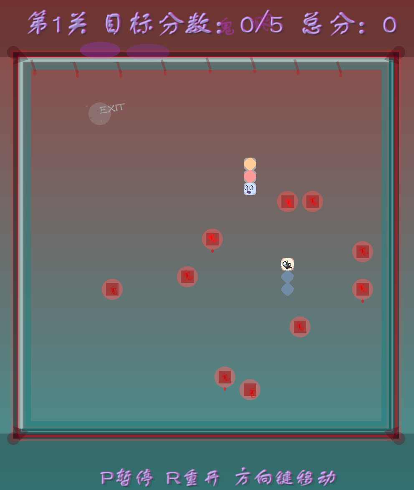

# 梦核/怪核/恐怖谷风格贪吃蛇（Rust + piston_window）

## 项目简介
本项目是一款以梦核（Dreamcore）、怪核（Weirdcore）、恐怖谷（Uncanny Valley）为主题的贪吃蛇游戏，采用 Rust 语言与 piston_window 框架开发。游戏在玩法、动画、UI、美术风格等方面进行了大量创新，营造出诡异、超现实、压迫感极强的氛围。

## 主要特色
- **梦核/怪核/恐怖谷美术风格**：全局画面抽搐、像素化/模糊、色彩扰动、符号闪现、迷雾、发光、残影、漂浮符号、血色雾气、哥特边框等。
- **主角蛇与AI蛇**：主角蛇为“受害者”形象，动态表情、颤抖、带泪痕；AI蛇为恐怖谷风格，蜡黄皮肤、错位眼睛、假笑、缝线、掉落黑色油滴粒子。
- **梦核UI与边框**：多层发光、残影、动态漂移、颜色变化，哥特风格多层嵌套边框，四角装饰、裂纹、滴血。
- **丰富的动态表现**：全局周期性抽搐、错位、缩放、旋转、伪模糊/重影、色彩扰动，所有动态效果均基于全局时间和sin/cos函数实现。
- **过场动画与状态管理**：进入游戏、关卡切换、胜利等均有梦核/怪核风格的过场动画，状态管理清晰，动画计时与渲染分离。

## 操作说明
- 方向键：控制蛇移动
- P：暂停/启动游戏
- R：重置游戏
- ESC：退出游戏

## 游戏截图



## 代码结构
```
├── Cargo.lock
├── Cargo.toml
├── src/
│   ├── main.rs                # 主循环、状态管理、UI与动画渲染
│   ├── snake_game/
│   │   ├── game.rs           # 游戏核心逻辑、关卡、碰撞、分数等
│   │   └── mod.rs
│   ├── snake_snake/
│   │   ├── snake.rs          # 蛇的实现、AI蛇、粒子、动态表现
│   │   └── mod.rs
│   └── snake_window/
│       ├── draw.rs           # 图形化封装、符号、边框、雾气等
│       └── mod.rs
```

## 技术细节
- piston_window 渲染，所有动态效果基于全局时间（bg_time）和 trigonometric 函数实现，参数可调。
- 代码结构清晰，便于扩展和美术细节微调。
- 多次修正 piston_window::text 颜色类型、glyphs 参数、ellipse 重复导入、flush 报错等常见问题。

## 美术与玩法自定义扩展点
- 可自定义梦核/怪核符号、边框、雾气、动画参数、粒子表现等。
- UI、过场、关卡切换等均可根据需求进一步美化和创新。

## 关于作者
- 目前专注于 Rust 游戏开发与美术风格探索。
